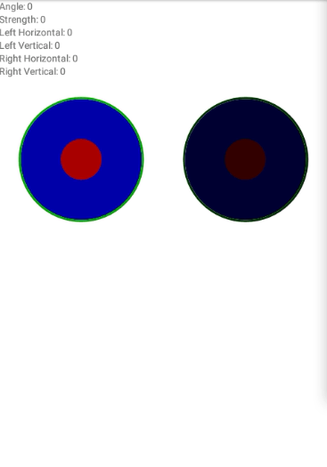

# NativeScript Virtual Joystick

The similar version of this plugin for the NativeScript 5
is available [here](https://github.com/OzymandiasTheGreat/nativescript-virtual-joystick)

### Disclaimer

> This plugin is almost fully based on the source code of [Victor Sossa](https://github.com/OzymandiasTheGreat/nativescript-virtual-joystick)
> Thank you guys for your hard work and contributions!

### Screenshot



### Installation

```javascript
ns plugin add @reazerdev/nativescript-virtual-joystick
```

### Usage

| Android Library                                              
| -------------------------------------------------------------
| [controlwear virtual-joystick-android](https://github.com/controlwear/virtual-joystick-android)

```html
<Page class="page"
  navigatingTo="onNavigatingTo"
  xmlns="http://schemas.nativescript.org/tns.xsd"
  xmlns:jv="@reazerdev/nativescript-virtual-joystick">
  <ActionBar class="action-bar">
    <Label class="action-bar-title" text="Virtual Joystick"></Label>
  </ActionBar>

  <StackLayout>
    <Label text="{{ 'Angle: ' + angle }}" />
    <Label text="{{ 'Strength: ' + strength }}" />

    <Label text="{{ 'Left Horizontal: ' + lx }}" />
    <Label text="{{ 'Left Vertical: ' + ly }}" />

    <Label text="{{ 'Right Horizontal: ' + rx }}" />
    <Label text="{{ 'Right Vertical: ' + ry }}" />

    <StackLayout orientation="horizontal">
      <jv:VirtualJoystick
        move="onMove"
        angle="{{ angle }}"
        strength="{{ strength }}"
        xAxis="{{ lx }}"
        yAxis="{{ ly }}"
        jvColor="#AA0000"
        jvBackgroundColor="#0000AA"
        jvBorderColor="#00AA00"
        width="50%" />

      <jv:VirtualJoystick
        angle="{{ angle }}"
        strength="{{ strength }}"
        xAxis="{{ rx }}"
        yAxis="{{ ry }}"
        jvColor="#330000"
        jvBackgroundColor="#000033"
        jvBorderColor="#003300"
        buttonStickToBorder="true"
        width="50%" />
    </StackLayout>
  </StackLayout>
</Page>
```

```typescript
import { NavigatedData, Page } from "@nativescript/core";
import { HomeViewModel } from "./home-view-model";
import { VirtualJoystickEventData } from '@reazerdev/nativescript-virtual-joystick';

export function onNavigatingTo(args: NavigatedData) {
  const page = <Page>args.object;

  page.bindingContext = new HomeViewModel();
}

export function onMove(data: VirtualJoystickEventData) {
  console.log(`Angle: ${data.angle}`);
  console.log(`Strength: ${data.strength}`);
  console.log(`Horizontal: ${data.xAxis}`);
  console.log(`Vertical: ${data.yAxis}`);
}
```

### Usage within Angular Apps

Import an Angular Module

```typescript
import { NativeScriptVirtualJoystickModule } from '@reazerdev/nativescript-virtual-joystick/angular';

@NgModule({
    [
       ...,
       NativeScriptVirtualJoystickModule
    ],
    ...
})
export class AppModule {}
```

Use custom element in your views

```html
<StackLayout orientation="horizontal">
  <VirtualJoystick
    (move)="onMove($event)"
    angle="{{ angle }}"
    strength="{{ strength }}"
    xAxis="{{ lx }}"
    yAxis="{{ ly }}"
    jvColor="#AA0000"
    jvBackgroundColor="#0000AA"
    jvBorderColor="#00AA00"
    width="50%" />

  <VirtualJoystick
    angle="{{ angle }}"
    strength="{{ strength }}"
    xAxis="{{ rx }}"
    yAxis="{{ ry }}"
    jvColor="#330000"
    jvBackgroundColor="#000033"
    jvBorderColor="#003300"
    buttonStickToBorder="true"
    width="50%" />
</StackLayout>
```

```typescript
import { Component } from '@angular/core';
import { VirtualJoystickEventData } from '@reazerdev/nativescript-virtual-joystick';

@Component({
  selector: 'ns-home',
  templateUrl: './home.component.html',
  styleUrls: ['./home.component.scss']
})
export class HomeComponent {
  public onMove(event: VirtualJoystickEventData) {
    console.log(event.angle);
    console.log(`Strength: ${data.strength}`);
    console.log(`Horizontal: ${data.xAxis}`);
    console.log(`Vertical: ${data.yAxis}`);
  }
}
```

## API

| Property | Css | Type | Default | Description |
| --- | --- | --- | --- | --- |
| angle | - | number | -1 | Read only. The angle of the button. Counter-clockwise, 0 is right. |
| strength | - | number | 0 | Read only. The distance from center in the range 0 - 100. |
| xAxis | - | number | 0 | Read only. The distance from center on horizontal axis in the range of -1 (left) to 1 (right). |
| yAxis | - | number | 0 | Read only. The distance from center on vertical axis in the range of -1 (down) to 1 (up). |
| jvColor | jv-color | Color | #000000 | The color of the button. If image is provided this property is ignored. |
| jvImage | jv-image | string | undefined | The image to use as button. |
| jvBackgroundColor | jv-background-color | Color | transparent | The color of range circle. |
| jvBorderColor | jv-border-color | Color | transparent | The color of range circle border. |
| jvBorderWidth | jv-border-width | number | 3 | The thickness of the range circle border. |
| buttonAutoRecenter | - | boolean | true | - |
| buttonStickToBorder | - | boolean | false | If set to true, button only has 2 states: centered (strength 0) or pushed (strength 100). |
| buttonDirection | - | number | 0 | Restrict button movement. 0 means all directions, positive number restricts movement to vertical axis, negative number -- horizontal axis. |
| buttonSizeRatio | - | number | 0.25 | Button size ratio relative to widget size. |
| backgroundSizeRatio | - | number | 0.75 | Range circle size ratio relative to widget size. |
| fixedCenter | - | boolean | true | Whether button center (strength 0) is fixed to widget center or relative to touchdown point. |
| enabled | - | boolean | true | Whether widget accepts taps and emits events. |

## License

Apache License Version 2.0
